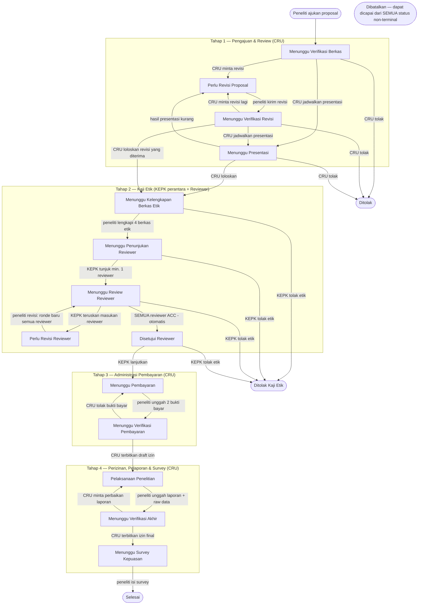

# PRD — eResearch Proposal (eProposal RSPI)

> **Apa yang dijelaskan di sini:** produk, aktor, dan proses bisnis. Bukan kode.
> Teknologi & infrastruktur → [arsitektur.md](arsitektur.md) · database → [skema.md](skema.md) ·
> tampilan → [design.md](design.md) · aturan kerja → [rules.md](rules.md) ·
> pekerjaan yang belum selesai → [task.md](task.md).
>
> Dokumen ini menggambarkan **sistem sebagaimana berjalan sekarang** — sudah dicocokkan
> dengan `app/Enums/ProposalStatus.php`, `app/Services/ProposalWorkflow.php`, dan
> `app/Livewire/Proposal/Show.php`. Kalau alur di kode berubah, file ini ikut diubah.

---

## 1. Ringkasan Produk

**eProposal** adalah aplikasi web pengelolaan **pengajuan dan review proposal penelitian** di
RSPI Prof. Dr. Sulianti Saroso. Peneliti internal/eksternal mengajukan proposal secara daring,
petugas memverifikasi bertahap sampai izin penelitian terbit dan penelitian selesai, lalu
peneliti mengisi survey kepuasan.

**Masalah yang diselesaikan** — sebelumnya proses ini manual (dokumen fisik, email, spreadsheet):
status penelitian sulit dipantau, dokumen tersebar, tidak jelas siapa mengakses data pasien,
tidak ada audit trail, laporan tahunan sulit disusun.

| Hal | Nilai |
|---|---|
| Nama tampilan | eResearch Proposal |
| Kode proposal | `RSPISS-YYYY-###` — increment per tahun, mis. `RSPISS-2026-001` |
| Alur | 4 tahap sequential, unit pemegang berpindah antar tahap |
| Sumber kebenaran status | satu kolom `proposal.status` (enum); tahap & unit adalah **turunan** |

### Scope

Manajemen proposal · workflow persetujuan multi-unit · ethical review (KEPK) · penunjukan &
telaah reviewer · upload dokumen bertahap · administrasi pembayaran · penerbitan izin ·
survey kepuasan · dashboard · laporan · audit log · RBAC + menu dinamis.

**Di luar scope saat ini** (ada di rencana, belum dibangun — lihat [task.md](task.md)):
dataset request ke Rekam Medis, monitoring penelitian berjalan, payment gateway,
titik masuk khusus Direksi/Rekam Medis/Auditor. **Chat antar pengguna tidak ada** dan
tidak direncanakan ulang untuk saat ini.

---

## 2. Aktor & Hak Akses

Sembilan role terdaftar (`database/seeders/RoleSeeder.php`). Hak akses tidak di-hardcode:
tiap menu punya 4 permission `{slug}.read|create|update|delete`, dipetakan ke role lewat
menu **Role & Permission** (superadmin).

| Aktor | Peran | Akses awal (seeder) |
|---|---|---|
| **Superadmin** | Administrasi sistem penuh: user, role, menu, master data | semua menu, `crud` |
| **CRU** (Clinical Research Unit) | Pemilik **Tahap 1, 3, 4**: verifikasi berkas, minta revisi/presentasi/tolak, verifikasi pembayaran, terbitkan izin | `antrian-cru.read/update`, `laporan.read`, `dashboard.read` |
| **KEPK** (Komite Etik Penelitian Kesehatan) | Pemilik **Tahap 2**: terima berkas etik, tunjuk reviewer, teruskan revisi, loloskan/tolak etik | `kaji-etik.read/update`, `dashboard.read` |
| **Reviewer** | Telaah ilmiah/etik berkas Tahap 2; jawaban **ke KEPK**, bukan ke peneliti | `antrian-reviewer.read/update`, `dashboard.read` |
| **Peneliti** | Ajukan proposal, unggah dokumen bertahap, revisi, bayar, unggah laporan, isi survey | `proposal.read/create/update`, `dashboard.read` |
| **Administrator** | Operasional aplikasi: antrian, master survey, informasi kontak & biaya | `antrian-cru.read/update`, `master-survey.crud`, `informasi-kontak.read/update` |
| **Direksi** | Pemantauan tingkat pimpinan | `antrian-cru.read`, `laporan.read`, `dashboard.read` |
| **Auditor** | Audit trail & kepatuhan, read-only | `audit-log.read`, `laporan.read`, `dashboard.read` |
| **Rekam Medis** | Penyedia data penelitian (fitur dataset request belum dibangun) | `dashboard.read` |

> Matriks di atas adalah **kondisi awal dari seeder**, bukan aturan permanen. Superadmin bisa
> mengubahnya kapan saja lewat UI tanpa menyentuh kode.

---

## 3. Alur Utama

Alur **sequential** dengan cabang revisi/tolak. Bola (siapa yang harus bertindak) selalu bisa
dibaca dari status.

Tiga status terminal: `Selesai`, `Ditolak` (CRU), `Ditolak Kaji Etik` (KEPK). `Dibatalkan`
sengaja tidak digambar bergaris karena bisa dicapai dari status non-terminal mana pun.

### Tahap 1 — Pengajuan & Review Proposal *(CRU)*
1. Peneliti mengajukan proposal: peneliti utama, tim peneliti, judul; unggah **surat pengantar**
   & **proposal** (wajib), kaji etik & sertifikat GCP (opsional).
2. CRU me-review berkas.
3. CRU menjadwalkan presentasi (tanggal, kategori, media).
4. Dari hasil review/presentasi CRU memilih: **minta revisi**, **tolak**, atau **loloskan ke KEPK**.
5. Bila CRU meminta revisi, proposal yang sudah diperbaiki peneliti (`Menunggu Verifikasi Revisi`)
   **bisa langsung diloloskan ke KEPK** — presentasi cukup sekali, tidak perlu dijadwalkan ulang
   hanya demi meloloskan. Presentasi kedua tetap mungkin bila memang diperlukan.

### Tahap 2 — Kaji Etik *(KEPK sebagai perantara + Reviewer)*
1. Peneliti melengkapi **4 berkas etik wajib**: form kaji etik, informed consent, PKS,
   kerahasiaan data → bola pindah ke KEPK.
2. KEPK **menunjuk minimal 1 reviewer** (boleh lebih). Proposal masuk antrian tiap reviewer.
3. Reviewer menelaah lalu memberi **komentar + opsional file tanggapan + ACC / minta revisi**.
   Jawaban ini **masuk ke KEPK, bukan ke peneliti**.
4. KEPK meneruskan intinya ke peneliti (identitas & komentar asli reviewer dirahasiakan).
   Peneliti merevisi → **semua penugasan reviewer di-reset ke ronde baru**; loop bisa >1×.
5. Begitu **semua** reviewer ACC, status otomatis menjadi `Disetujui Reviewer`; KEPK lalu
   meloloskan ke Tahap 3 atau menolak secara etik.

### Tahap 3 — Administrasi Pembayaran *(CRU)*
Peneliti melakukan **dua pembayaran terpisah** — ke CRU dan ke KEPK — lalu mengunggah
**dua bukti bayar**. CRU memverifikasi; bila tidak sah, status mundur ke `Menunggu Pembayaran`.
Nomor rekening & rincian biaya diambil dari master **Informasi Kontak**.

### Tahap 4 — Perizinan, Pelaporan & Survey *(CRU)*
1. CRU menerbitkan **surat izin draft** → peneliti boleh melaksanakan penelitian.
2. Peneliti mengunggah **laporan penelitian + raw data**. CRU boleh mengembalikannya bila kurang.
3. CRU menerbitkan **surat izin final** — tetapi **unduhannya terkunci** sampai peneliti
   mengisi **survey kepuasan**. Setelah survey terisi → status `Selesai` dan izin final terbuka.

---

## 4. Status, Tahap, dan Unit

18 nilai status. Tahap dan unit **tidak disimpan sebagai keputusan terpisah** — keduanya
diturunkan dari status (`ProposalStatus::tahapan()` dan `::unit()`). `unit_sekarang` disimpan
di tabel hanya sebagai materialisasi agar antrian bisa di-index.

| # | Status | Tahap | Unit | Bola di | Pemicu masuk |
|---|---|:---:|---|---|---|
| 1 | `Menunggu Verifikasi Berkas` | 1 | penelitian | CRU | peneliti ajukan |
| 2 | `Perlu Revisi Proposal` | 1 | penelitian | Peneliti | CRU minta revisi |
| 3 | `Menunggu Verifikasi Revisi` | 1 | penelitian | CRU | peneliti kirim revisi |
| 4 | `Menunggu Presentasi` | 1 | penelitian | Peneliti | CRU jadwalkan presentasi |
| 5 | `Menunggu Kelengkapan Berkas Etik` | 2 | kaji_etik | Peneliti | CRU loloskan |
| 6 | `Menunggu Penunjukan Reviewer` | 2 | kaji_etik | KEPK | peneliti lengkapi berkas etik |
| 7 | `Menunggu Review Reviewer` | 2 | reviewer | Reviewer (semua yang ditugaskan) | KEPK tunjuk reviewer |
| 8 | `Perlu Revisi Reviewer` | 2 | kaji_etik | Peneliti | KEPK teruskan masukan reviewer |
| 9 | `Disetujui Reviewer` | 2 | kaji_etik | KEPK | **semua** reviewer ACC (otomatis) |
| 10 | `Menunggu Pembayaran` | 3 | penelitian | Peneliti | KEPK lanjutkan |
| 11 | `Menunggu Verifikasi Pembayaran` | 3 | penelitian | CRU | peneliti unggah 2 bukti bayar |
| 12 | `Pelaksanaan Penelitian` | 4 | penelitian | Peneliti | CRU terbitkan draft izin |
| 13 | `Menunggu Verifikasi Akhir` | 4 | penelitian | CRU | peneliti unggah laporan + raw data |
| 14 | `Menunggu Survey Kepuasan` | 4 | penelitian | Peneliti | CRU terbitkan izin final |
| 15 | `Selesai` | — | — | — | peneliti isi survey *(terminal)* |
| 16 | `Ditolak` | — | penelitian | — | CRU tolak *(terminal)* |
| 17 | `Ditolak Kaji Etik` | — | kaji_etik | — | KEPK tolak *(terminal)* |
| 18 | `Dibatalkan` | — | — | — | CRU batalkan dari status non-terminal mana pun *(terminal)* |

Transisi yang sah dikunci di `ProposalStatus::allowedNext()`; percobaan meloncat ditolak 403
oleh `ProposalWorkflow::transition()`. Daftar transisi lengkap ada di [skema.md](skema.md#4-enum).

---

## 5. Input & Berkas per Langkah

| Aksi → Status | Aktor | Input / berkas |
|---|---|---|
| Ajukan → `Menunggu Verifikasi Berkas` | Peneliti | peneliti utama, tim peneliti, judul; **surat_pengantar**, **proposal** (wajib), `kaji_etik`, `sertifikat_gcp` (opsional) |
| Minta revisi → `Perlu Revisi Proposal` | CRU | catatan; opsional `surat_tanggapan` |
| Kirim revisi → `Menunggu Verifikasi Revisi` | Peneliti | re-upload `proposal` |
| Jadwalkan → `Menunggu Presentasi` | CRU | tanggal, kategori, media presentasi |
| Tolak → `Ditolak` | CRU | `surat_penolakan` (wajib) |
| Loloskan → `Menunggu Kelengkapan Berkas Etik` | CRU | catatan (opsional). Tersedia dari `Menunggu Presentasi` **maupun** `Menunggu Verifikasi Revisi` |
| Lengkapi etik → `Menunggu Penunjukan Reviewer` | Peneliti | **form_kaji_etik**, **informed_consent**, **pks**, **kerahasiaan_data** (semua wajib) |
| Tunjuk reviewer → `Menunggu Review Reviewer` | KEPK | pilih ≥1 user ber-role reviewer |
| Tanggapan reviewer *(status tetap)* | Reviewer | komentar (wajib bila minta revisi) + opsional `tanggapan_reviewer` + ACC/revisi |
| Teruskan revisi → `Perlu Revisi Reviewer` | KEPK | catatan untuk peneliti (wajib); opsional `surat_tanggapan`. Hanya aktif bila ada reviewer yang meminta revisi |
| Kirim revisi etik → `Menunggu Review Reviewer` | Peneliti | re-upload ≥1 berkas etik; semua penugasan reviewer reset |
| Semua ACC → `Disetujui Reviewer` | (otomatis) | — |
| Tolak etik → `Ditolak Kaji Etik` | KEPK | alasan (wajib), tercatat di `proposal_reviews` |
| Lanjutkan → `Menunggu Pembayaran` | KEPK | hanya aktif bila semua reviewer ACC |
| Bayar → `Menunggu Verifikasi Pembayaran` | Peneliti | **bukti_bayar_cru** + **bukti_bayar_kepk** (keduanya wajib) |
| Terbitkan draft → `Pelaksanaan Penelitian` | CRU | `izin_draft` (wajib) |
| Unggah hasil → `Menunggu Verifikasi Akhir` | Peneliti | `laporan_penelitian` (pdf) + `raw_data` (xls/xlsx) |
| Terbitkan final → `Menunggu Survey Kepuasan` | CRU | `izin_final` (wajib) |
| Isi survey → `Selesai` | Peneliti | jawaban per pertanyaan wajib + saran |

Batas ukuran & format per jenis dokumen ada di `DocumentType::aturanValidasi()`
(pdf 10 MB · bukti bayar jpg/pdf 5 MB · raw data xls/xlsx 20 MB) — lihat
[arsitektur.md](arsitektur.md#4-penyimpanan-file).

---

## 6. Aturan Bisnis yang Tidak Boleh Dilanggar

1. **Kerahasiaan reviewer.** Komentar reviewer, file `tanggapan_reviewer`, dan identitas
   reviewer **tidak pernah** terlihat oleh peneliti. Peneliti hanya menerima rangkuman dari
   KEPK. Di riwayat status yang dilihat peneliti, pelaku disamarkan menjadi "Reviewer".
2. **Reviewer hanya melihat proposal yang ditugaskan kepadanya**, bukan seluruh antrian.
3. **KEPK tidak bisa mendahului reviewer.** Meneruskan revisi hanya bila ada reviewer yang
   meminta revisi; melanjutkan ke Tahap 3 hanya bila **semua** reviewer ACC.
4. **Dua pembayaran terpisah** (CRU + KEPK) — keduanya wajib sebelum verifikasi.
5. **Gate survey.** Unduhan `izin_final` oleh peneliti ditolak (403) sampai baris survey
   untuk proposal itu ada. Satu survey aktif per proposal.
6. **Tidak ada loncat status.** Semua perubahan status lewat `ProposalWorkflow`, divalidasi
   `canGoTo()`, dan tercatat di `proposal_status_history` (siapa, dari mana ke mana, kapan, catatan).
7. **Nomor proposal unik per tahun**, dijaga advisory lock + unique `(tahun, nomor)`.

---

## 7. Non-Goals

- Bukan aplikasi messaging: **tidak ada chat** antar pengguna.
- Tidak ada 2FA pada login.
- Tidak ada notifikasi push/SMS; email hanya untuk verifikasi akun & reset password.
- Tidak ada tanda tangan digital pada surat izin (dokumen diunggah sebagai PDF jadi).

---

## Konversi ke PDF

Diagram di atas adalah blok `mermaid` — dirender langsung oleh preview Markdown VS Code
dan GitHub. Untuk menghasilkan PDF:

- **VS Code**: ekstensi *Markdown PDF* (klik kanan → *Markdown PDF: Export (pdf)*) atau
  *Markdown Preview Enhanced* (klik kanan pada preview → *Chrome (Puppeteer) → PDF*).
- **CLI**: `npx @mermaid-js/mermaid-cli -i prd.md -o prd.out.md` untuk mengubah blok mermaid
  jadi gambar, lalu `pandoc prd.out.md -o prd.pdf`.
