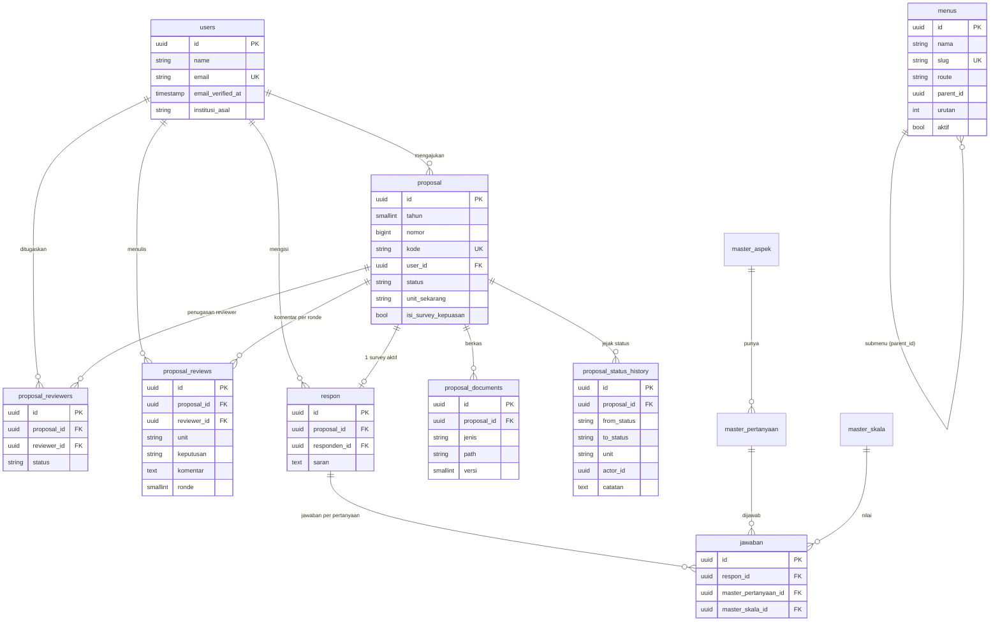

# Skema Database — eProposal

> Proses bisnis → [prd.md](prd.md) · stack & infra → [arsitektur.md](arsitektur.md) ·
> aturan kerja → [rules.md](rules.md).
>
> Isi file ini **sudah dicocokkan dengan `database/migrations/` dan database nyata**
> (`eprotocol` @ PostgreSQL 14.23, dicek read-only lewat `artisan db:table`).
> Bukan rancangan target — ini kondisi terpasang.

---

## 1. Konvensi Wajib

Berlaku untuk **semua** tabel domain (bukan tabel bawaan Laravel/spatie).

| Kolom | Tipe | Keterangan |
|---|---|---|
| `id` | uuid | PK, UUIDv7 (`Str::uuid7()`) |
| `created_at` / `updated_at` | timestamp | `$t->timestamps()` |
| `deleted_at` | timestamp | `$t->softDeletes()` — semua tabel soft delete |
| `created_by` / `updated_by` / `deleted_by` | uuid | pelaku aksi, diisi otomatis |

**Migration** — macro `auditColumns()` didaftarkan sekali di
`AppServiceProvider::boot()`, dipakai di semua migration:

```php
$t->uuid('id')->primary();
// ... kolom domain ...
$t->timestamps();
$t->softDeletes();
$t->auditColumns();   // created_by, updated_by, deleted_by
```

**Model** — trait `App\Concerns\HasUuidAndAudit` mengisi `id` dan kolom audit lewat event
`creating` / `updating` / `deleting`, plus relasi `createdBy()`, `updatedBy()`, `deletedBy()`:

```php
class Proposal extends Model
{
    use HasUuidAndAudit, SoftDeletes;

    protected $table = 'proposal';
    public $incrementing = false;
    protected $keyType = 'string';
}
```

**Schema PostgreSQL:** seluruh 26 tabel berada di schema **`public`**. (Aplikasi lama memakai
schema `eproposal`/`survey`; rancangan itu tidak jadi dipakai.)

**Foreign key sengaja ditunda.** Kolom relasi `*_id` ada dan ter-index, tapi tanpa constraint FK.
Integritas dijaga di layer aplikasi (`ProposalWorkflow`, guard di komponen Livewire).

---

## 2. ERD



Tabel yang tidak digambar karena berdiri sendiri: `informasi_kontak` (singleton konfigurasi),
tabel RBAC spatie, dan tabel infrastruktur Laravel (§7).

---

## 3. Tabel Inti Proposal

### `proposal`
Satu baris = satu pengajuan. Tidak ada kolom file di sini (semua di `proposal_documents`),
tidak ada kolom tahapan (turunan status).

| Kolom | Tipe | Keterangan |
|---|---|---|
| `id` | uuid | PK |
| `tahun` | smallint | tahun pengajuan |
| `nomor` | bigint | urut per tahun |
| `kode` | varchar **unique** | `RSPISS-YYYY-###` |
| `peneliti_utama` | varchar | |
| `tim_peneliti` | text null | |
| `judul_penelitian` | text | |
| `institusi_asal` / `email` / `phone` | varchar null | snapshot pengaju saat mengajukan |
| `user_id` | uuid | pengaju |
| `status` | varchar | cast enum `ProposalStatus` |
| `unit_sekarang` | varchar null | cast enum `Unit`; **turunan status**, disimpan agar antrian ter-index |
| `tanggal_presentasi` | timestamp null | |
| `kategori_presentasi` / `media_presentasi` | varchar null | |
| `isi_survey_kepuasan` | boolean default false | di-set `true` saat status → `Selesai` |

Index: `unique(kode)` · `unique(tahun, nomor)` · index `status`, `unit_sekarang`, `user_id`.

### `proposal_documents`
Satu baris = satu file. Menambah jenis dokumen = menambah nilai enum `DocumentType`,
**bukan** menambah kolom.

| Kolom | Tipe | Keterangan |
|---|---|---|
| `proposal_id` | uuid | |
| `jenis` | varchar | enum `DocumentType` |
| `path` | varchar | path **relatif** di disk `dokumen` — `proposal/{id}/{jenis}/{file}` |
| `nama_asli` | varchar null | nama file saat diunggah |
| `versi` | smallint default 1 | naik otomatis per (proposal, jenis) → riwayat revisi |
| `uploaded_by` | uuid null | |

Index: `(proposal_id, jenis)`.

### `proposal_status_history`
Audit tektokan status. Ditulis otomatis oleh `ProposalWorkflow::catatHistory()` pada setiap
transisi — termasuk pengajuan pertama (`from_status = null`).

| Kolom | Keterangan |
|---|---|
| `proposal_id` | |
| `from_status` / `to_status` | nilai enum `ProposalStatus` |
| `unit` | unit tujuan (enum `Unit`) |
| `actor_id` | user yang memindahkan |
| `catatan` | catatan bebas dari pelaku |

Index: `proposal_id`.

### `proposal_reviews`
Komentar & keputusan per ronde — dipakai reviewer (unit `reviewer`) dan KEPK saat menolak
etik (unit `kaji_etik`).

| Kolom | Keterangan |
|---|---|
| `tahap` | tinyint 1..4 |
| `unit` | enum `Unit` |
| `reviewer_id` | penulis |
| `keputusan` | `approve` \| `revise` \| `reject` |
| `komentar` | teks |
| `ronde` | naik per reviewer tiap kali merespons |

Index: `(proposal_id, ronde)`.

### `proposal_reviewers`
Penugasan reviewer oleh KEPK — bisa lebih dari satu per proposal.

| Kolom | Keterangan |
|---|---|
| `reviewer_id` | user ber-role reviewer |
| `status` | `menunggu` \| `acc` \| `revisi` |

Index `(reviewer_id, status)` + **partial unique** `(proposal_id, reviewer_id) where deleted_at is null`.

Aturan: antrian reviewer = proposal berstatus `Menunggu Review Reviewer` yang penugasannya
`menunggu`. Semua penugasan `acc` → proposal otomatis `Disetujui Reviewer`. Peneliti kirim
revisi → semua penugasan di-reset ke `menunggu` (ronde baru).

---

## 4. Enum

Semua nilai disimpan sebagai string di kolom `varchar`, di-cast lewat `$casts` model.

### `App\Enums\ProposalStatus` (18 nilai)

Daftar nilai, tahap, dan unit ada di [prd.md §4](prd.md#4-status-tahap-dan-unit). Peta
transisi yang sah (`allowedNext()`):

| Dari | Boleh ke |
|---|---|
| `Menunggu Verifikasi Berkas` | `Perlu Revisi Proposal`, `Menunggu Presentasi`, `Ditolak` |
| `Perlu Revisi Proposal` | `Menunggu Verifikasi Revisi` |
| `Menunggu Verifikasi Revisi` | `Menunggu Kelengkapan Berkas Etik` *(loloskan tanpa presentasi ulang)*, `Perlu Revisi Proposal`, `Menunggu Presentasi`, `Ditolak` |
| `Menunggu Presentasi` | `Menunggu Kelengkapan Berkas Etik`, `Perlu Revisi Proposal`, `Ditolak` |
| `Menunggu Kelengkapan Berkas Etik` | `Menunggu Penunjukan Reviewer`, `Ditolak Kaji Etik` |
| `Menunggu Penunjukan Reviewer` | `Menunggu Review Reviewer`, `Ditolak Kaji Etik` |
| `Menunggu Review Reviewer` | `Perlu Revisi Reviewer`, `Disetujui Reviewer`, `Ditolak Kaji Etik` |
| `Perlu Revisi Reviewer` | `Menunggu Review Reviewer` |
| `Disetujui Reviewer` | `Menunggu Pembayaran`, `Ditolak Kaji Etik` |
| `Menunggu Pembayaran` | `Menunggu Verifikasi Pembayaran` |
| `Menunggu Verifikasi Pembayaran` | `Pelaksanaan Penelitian`, `Menunggu Pembayaran` *(mundur)* |
| `Pelaksanaan Penelitian` | `Menunggu Verifikasi Akhir` |
| `Menunggu Verifikasi Akhir` | `Menunggu Survey Kepuasan`, `Pelaksanaan Penelitian` *(mundur)* |
| `Menunggu Survey Kepuasan` | `Selesai` |
| `Selesai`, `Ditolak`, `Ditolak Kaji Etik`, `Dibatalkan` | — *(terminal)* |

`Dibatalkan` tidak muncul di tabel: `canGoTo()` mengizinkannya dari **semua** status non-terminal.

Helper lain di enum ini: `tahapan()` (1–4, `null` untuk terminal) · `unit()` (enum `Unit`,
`null` untuk `Selesai`/`Dibatalkan`) · `isTerminal()` · `warna()` (kelas badge daisyUI) ·
`bolaDiPeneliti()`.

### `App\Enums\DocumentType` (17 nilai)

| Kelompok | Nilai |
|---|---|
| Tahap 1 | `surat_pengantar`, `proposal` *(wajib)*; `kaji_etik`, `sertifikat_gcp` *(opsional)* |
| Tahap 2 | `form_kaji_etik`, `informed_consent`, `pks`, `kerahasiaan_data` *(semua wajib)* |
| Tahap 3 | `bukti_bayar_cru`, `bukti_bayar_kepk` *(keduanya wajib)* |
| Tahap 4 | `laporan_penelitian`, `raw_data` |
| Output admin | `izin_draft`, `izin_final`, `surat_penolakan`, `surat_tanggapan`, `tanggapan_reviewer` |

Helper: `label()` · `wajibTahap1()` / `opsionalTahap1()` / `wajibTahap2()` ·
`aturanValidasi()` (aturan upload Livewire) · `milikAdmin()`.
`tanggapan_reviewer` tidak pernah bisa diunduh peneliti (dijaga `DocumentDownloadController`).

### `App\Enums\Unit` (3 nilai)
`penelitian` (CRU) · `kaji_etik` (KEPK) · `reviewer`. Kosakata yang sama dipakai di
`proposal.unit_sekarang`, `proposal_status_history.unit`, dan `proposal_reviews.unit`.

---

## 5. Survey Kepuasan

| Tabel | Isi |
|---|---|
| `master_aspek` | `nama_aspek`, `deskripsi`, `urutan`, `status_aktif` |
| `master_pertanyaan` | `master_aspek_id`, `pertanyaan`, `is_required`, `urutan`, `status_aktif` |
| `master_skala` | `nama_skala`, `nilai` (int), `urutan` |
| `respon` | `proposal_id`, `responden_id`, `responden` & `jenis_responden` (snapshot), `saran` |
| `jawaban` | `respon_id`, `master_pertanyaan_id`, `master_skala_id`, + snapshot teks `pertanyaan` & `jawaban` |

**Partial unique** `respon (proposal_id) where deleted_at is null` — satu survey aktif per
proposal. Baris `respon` inilah yang membuka kunci unduhan `izin_final`.

Snapshot teks pertanyaan & jawaban disimpan di `jawaban` supaya laporan lama tidak berubah
ketika master pertanyaan/skala diedit.

---

## 6. Menu Dinamis & Informasi Kontak

### `menus`
`nama`, `slug` (unique), `route`, `icon`, `parent_id`, `urutan`, `aktif`.
Index `(parent_id, urutan)`.

`MenuObserver` → `MenuPermissionSync` menjaga permission spatie tetap sinkron:
menu dibuat → `{slug}.read|create|update|delete` dibuat; slug diganti → permission di-rename;
menu dihapus → permission dihapus. Cache permission di-flush tiap perubahan.

### `informasi_kontak`
Tabel konfigurasi satu-baris: telepon, fax, callcenter, hotline, email, alamat, sosial media,
contact person per layanan (kaji etik, PKS, MTA, kerahasiaan), serta **data rekening
pembayaran** (`pemilik_rekening`, `nomor_rekening`, `nama_bank`, `logo_bank`, `deskripsi_biaya`)
yang ditampilkan ke peneliti pada Tahap 3.

---

## 7. Tabel Bawaan

**RBAC (spatie/laravel-permission v8):** `permissions`, `roles`, `model_has_permissions`,
`model_has_roles`, `role_has_permissions`. Morph key di-set ke **uuid**; `'teams' => false`.

**Laravel:** `users`, `password_reset_tokens`, `sessions`, `cache`, `cache_locks`, `jobs`,
`job_batches`, `failed_jobs`, `migrations`.

`users` mengikuti konvensi §1 (uuid + softDeletes + auditColumns) dan menambah kolom domain:
`username` (unique, nullable), `phone`, `jk`, `institusi_asal`, `kategori_pendidikan`.

---

## 8. Keputusan Desain yang Terkunci

| # | Isu | Keputusan terpasang |
|---|---|---|
| D1 | Tahap untuk status terminal | `tahapan()` mengembalikan `null` |
| D2 | `unit_sekarang` | disimpan + index, di-sync `ProposalWorkflow::transition()` |
| D3 | Kosakata unit | enum `Unit` = `penelitian\|kaji_etik\|reviewer` di semua tabel |
| D4 | Jalan mundur | verifikasi pembayaran → menunggu pembayaran; verifikasi akhir → pelaksanaan; plus `Dibatalkan` dari semua status non-terminal |
| D5 | Survey per proposal | `respon.proposal_id` + partial unique; gate unduh di `DocumentDownloadController` |
| D6 | Kode proposal | `RSPISS-YYYY-###`; kolom `tahun` + `nomor` dengan `unique(tahun, nomor)`, dijaga `pg_advisory_xact_lock` |

---

## Konversi ke PDF

ERD di atas adalah blok `mermaid`, dirender oleh preview Markdown VS Code & GitHub.
Cara ekspor PDF sama seperti [prd.md](prd.md#konversi-ke-pdf): ekstensi *Markdown PDF* /
*Markdown Preview Enhanced* di VS Code, atau `mermaid-cli` + `pandoc` lewat CLI.
